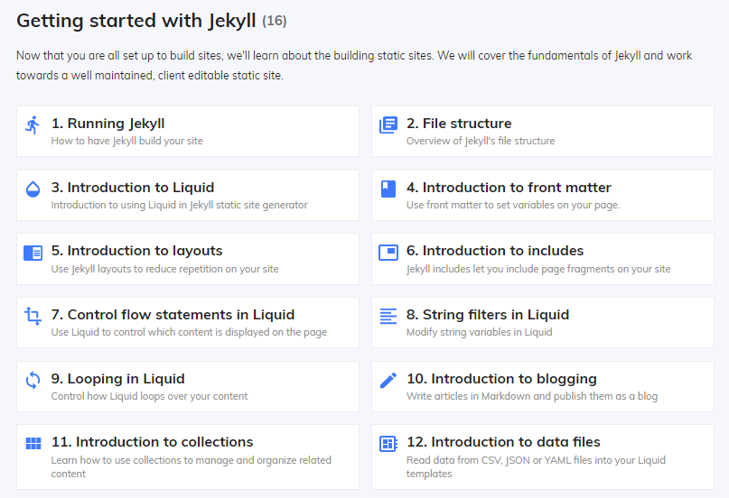

Going off the original THETA website there were about 4 different page layouts. I built the 4 page layouts in HTML & CSS and was then able to use Jekyll to allocate the layouts to specific pages. 

In the process of looking up Jekyll tutorials I stumbled across CloudCannon, who happen to be a Dunedin based Jekyll CMS. They also have an array of useful Jekyll tutorials which helped me a lot to get the site up and running. 

I found this tutorial particularly useful for setting up the page layouts. 

<iframe width="560" height="315" src="https://www.youtube.com/embed/Gc2d-eGSSdQ" frameborder="0" allow="accelerometer; autoplay; encrypted-media; gyroscope; picture-in-picture" allowfullscreen></iframe>