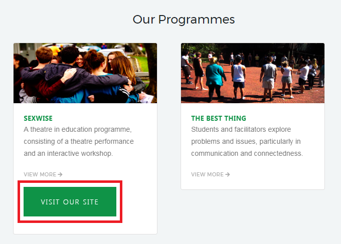
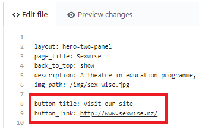

Control flow statements are a feature of liquid, similar to what you would find in php. It allows you to easily take control of what information is and isn't displayed on a page. This is particularly useful in Jekyll if you have a collection but only want to show members of the collection that have a specific attrubute.

I used control flow statments several times in the THETA site including on the home page for the programmes slider. This section is simply an interactive display of the various programmes THETA provide to schools. 

Control flow statements were useful here as the metadata varied from programme to programme. Some programmes had external link buttons to there own websites while others didn't as shown below.

The code below indicates that I'd like to display each programme in the programmes collection. 

    

     
    
      

        
        

          <a class="view-more" href="{{ programme.url }}"><h5 class="card-title">{{ programme.page_title}}</h5></a>
          
{{ programme.description }}

          

            <a href="{{ programme.url }}">View More <i class="fa fa-arrow-right"></i></a>
          

     
      
          
          <a target="_blank" href="{{ programme.button_link }}" class="btn btn-1 btn-1a">{{ programme.button_title }}</a>
           
          
        

      

      
    

The code below checks each programme in the programmes collection for the button_title variable. If a programme has this variable then the button link should also be displayed as part of the programmes section. Alternatively, if a programme doesn't have a button title then no button will be displayed. 

The red box below shows what the front matter of a programme with a button would look like. 

