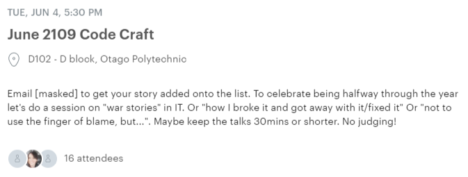
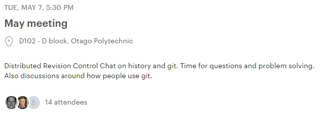
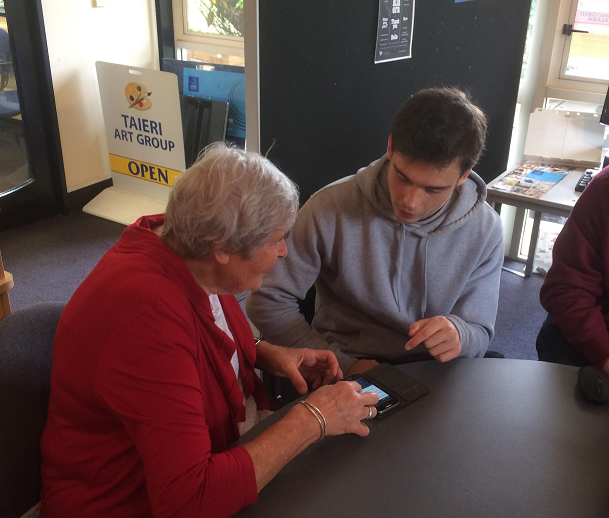

## Professional Development
  

#### <i class="fas fa-user-tie"></i> CodeCraft May Meetup
  
This months meetup was based around git. Some of the talks included distributed version control and the history of git.
I found the talks interesting but struggled to grasp a lot of what was being said as the majority of the people in the room had more than a decades worth of version control experience than I did.

#### CodeCraft June Meetup
  
The topic of discussion for this months meetup was "war stories" in IT. / "how I broke it and got away with it/fixed it". Again this talk had a high level of complexity to it but I was able to appreciate it as it also covered a lot of the experiences the speakers were exposed to while working in the industry. 

## External Engagement

#### Volunteering in Mosgiel 

Over the semester I did several trips out to Mosgiel Library as part of the BIT's volunteering project. 

